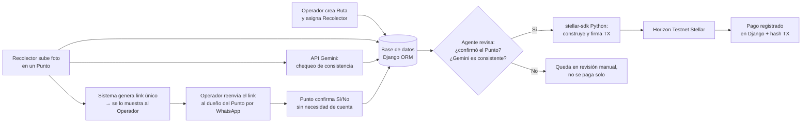

> **⚠️ Actualizado — pivote de narrativa al Caso 3 (recolección de aceite usado), misma arquitectura técnica ya definida.**

# Plan de Desarrollo — RutaVerificada (nombre tentativo)
**Stellar Odyssey Perú · Track: AI Agents & Automated Workflows**

> Supuesto que sigo dando por cierto: los 3 compañeros tienen bases de programación (no principiantes absolutos) y experiencia vibe-codeando con IA. Si cambia el equipo, hay que revisar la sección 5.

---

## 1. Qué vamos a construir (una frase)

Un agente que paga automáticamente en Stellar testnet solo cuando **un tercero independiente del recolector confirma la entrega** — nunca por el reporte del propio recolector — aplicado al caso real de recolección de aceite usado, donde el fraude ocurre porque el recolector controla toda la información que le llega al dueño del negocio.

**El caso real que inspira el proyecto:** un recolector desviaba parte del aceite recogido en su ruta, lo escondía acumulado en otro lugar, y luego se lo vendía a su propio empleador como si fuera "un cliente grande conseguido", cobrando comisión y bono de volumen sobre mercadería que ya le pertenecía al negocio. Se descubrió por casualidad, cuando un asistente nuevo lo delató. El sistema debía haber hecho innecesaria esa casualidad.

**Por qué esta narrativa y no la de "pago por tarea completada" (versión anterior del plan):** la versión anterior competía directo contra proyectos ya existentes en el showcase (TrustPreU, Crypto College — aprendizaje con recompensas). Este caso es un dominio distinto (logística/recolección) que nadie más cubrió, y el mecanismo de verificación tiene un porqué narrativo fuerte y fácil de explicar en el pitch: "no le creemos al que tiene el incentivo de mentir, le creemos a quien no gana nada mintiendo."

**Por qué el mecanismo es defendible técnicamente:** el trigger del agente es una regla de negocio verificable (confirmación de tercero + chequeo de consistencia), no una IA generativa "decidiendo" — eso es exactamente lo que pide el track 1, y es terminable en una semana.

---

## 2. Actores y flujo — explicado para que el equipo lo entienda sin leer código

**Los 3 actores del sistema:**

| Actor | Quién es en la vida real | Se registra en el sistema? |
|---|---|---|
| **Operador** (José) | Dueño del negocio de recolección, quien crea las rutas y paga las comisiones | Sí, tiene cuenta |
| **Recolector** (Luis) | Encargado de recoger el aceite en varios puntos durante su ruta | Sí, tiene cuenta |
| **Proveedor de punto** (ej. un restaurante que entrega su aceite usado) | Cada lugar donde el recolector recoge — no tiene cuenta, no necesita registrarse | No — recibe solo un link por punto de recolección |

**Por qué el Proveedor de punto no se registra:** forzar a cada restaurante o negocio pequeño a crear una cuenta es fricción que no se puede validar ni justificar en una semana. En su lugar, recibe un link único de confirmación — sin login, sin fricción.

**Flujo paso a paso:**

1. El **Operador** crea una `Ruta` con los puntos de recolección asignados a un **Recolector** específico (asignación directa, ej. `ruta1 → Luis`) — no es un tablón abierto donde cualquiera se ofrece; eso sumaría complejidad sin aportar nada al track.
2. El **Recolector** ve su ruta del día en su panel. Al llegar a cada punto, sube una foto de los baldes recogidos ahí — **este acto de subir la foto es lo que dispara el siguiente paso**, no una detección automática de ubicación (el GPS se descartó: es falsificable y no resuelve el problema real).
3. Al subir la foto, ocurren dos cosas en paralelo:
   - Se envía la foto a la **API de Gemini** con un prompt acotado (ej. "¿cuántos baldes ves en esta imagen?"). Es un **chequeo de consistencia de respaldo**, no la prueba principal — nunca se presenta como "prueba infalible de fraude", porque una foto se puede preparar de antemano.
   - El sistema genera un link único de confirmación para ese punto y se lo muestra **al Operador**, no al Recolector — el Operador se lo reenvía al dueño del punto de recolección por su propio WhatsApp. Esto es clave: si el link se lo mostráramos al propio Recolector, él podría confirmarse a sí mismo, y todo el mecanismo colapsaría (es exactamente el hueco que detectamos y cerramos en el diseño).
4. El dueño del punto de recolección abre el link (sin cuenta) y responde Sí/No a: "¿Confirmas que se recogieron [cantidad] baldes de aceite en tu local?"
5. El **agente** revisa dos condiciones antes de pagar la comisión al Recolector: (a) el punto confirmó "Sí", y (b) el conteo de Gemini está dentro de un rango razonable de lo reportado. Si ambas se cumplen, dispara la transacción en Stellar testnet automáticamente. Si algo no cuadra, el punto de recolección queda marcado como "en revisión" y no se paga solo — el Operador decide a mano.
6. Todo queda en el historial: la foto, la respuesta de Gemini, la confirmación del punto, el hash de la transacción (o el motivo de por qué no se pagó).

**Lo que el sistema sí resuelve del caso real:** que Luis desvíe volumen sin que quede registrado en ningún punto real de recolección — porque el pago depende de una confirmación que él no controla, no de su propio reporte.

**Lo que el sistema NO promete resolver, y hay que decirlo así en el pitch:** no es una prueba forense infalible. Es una automatización de una decisión que antes dependía enteramente de la palabra del recolector.

---

## 3. Decisión de stack, y el trade-off que implica

| Decisión | Por qué |
|---|---|
| **Backend: Django** | Es tu fuerte, y da un modelo de datos real (Operador, Recolector, Ruta, Punto, Pago) en vez de scripts sueltos. |
| **Stellar: `stellar-sdk` para Python** (no el de JS) | Se instala con `pip install stellar-sdk`. |
| **IA: API de Gemini** para el chequeo de consistencia de la foto | Cumple el requisito de usar IA sin pretender que "prueba" el fraude — es un dato de respaldo, no la señal decisiva. |
| **Frontend: templates de Django, sin React** | Con compañeros nuevos en la carrera, server-rendered es más fácil de tocar sin romper nada. |
| **Sin GPS/geolocalización** | Descartado: es falsificable desde el propio navegador y no resuelve el problema — la confirmación de un tercero sí lo resuelve. |
| **Sin marketplace/tablón de rutas** | Descartado por scope: la asignación directa Operador→Recolector ya cumple el track sin sumar trabajo de ingeniería que no suma a la nota. |
| **Sin Celery ni cola de tareas** | El pago se ejecuta de forma síncrona al confirmarse la entrega — una pieza menos que puede fallar en el demo. |

**El trade-off que debes aceptar:** más pesado de levantar que el sandbox del IDE web (servidor local, base de datos, ahora también una API key de Gemini). A cambio, es un producto real y defendible, no un script de prueba.

---

## 4. Arquitectura



---

## 5. Estructura de carpetas

```
rutaverificada/
├── manage.py
├── requirements.txt
├── .env.example                  ← nunca subir .env real (incluye GEMINI_API_KEY)
├── .gitignore
├── LICENSE                       ← MIT o Apache 2.0
│
├── rutaverificada/                configuración del proyecto Django
│   ├── settings.py
│   ├── urls.py
│   └── wsgi.py
│
├── core/                          la app principal
│   ├── models.py                 ← Operador, Recolector, Ruta, Punto, Pago
│   ├── views.py                  ← dashboard, subir foto, confirmación del punto (sin login)
│   ├── urls.py
│   ├── signals.py                ← dispara el chequeo de Gemini y genera el link al confirmarse
│   ├── stellar_agent.py          ← toda la lógica de Stellar vive aquí, separada
│   ├── gemini_check.py           ← llamada a la API de Gemini, aislada del resto
│   ├── admin.py
│   ├── templates/core/
│   │   ├── dashboard.html
│   │   ├── subir_foto.html
│   │   ├── confirmar_punto.html  ← la página sin login que ve el dueño del punto
│   │   └── detalle_pago.html
│   └── static/core/
│       └── style.css
│
├── scripts/                       utilidades sueltas, fuera de Django
│   ├── crear_wallet_testnet.py   ← genera keypair + Friendbot
│   └── verificar_pago.py         ← consulta un hash en Horizon
│
├── docs/
│   └── architecture.md           ← este diagrama, exportado
│
└── README.md                     ← entregable obligatorio de la hackathon
```

**Por qué `stellar_agent.py` y `gemini_check.py` están separados de `views.py`:** cualquiera del equipo puede tocar vistas o HTML sin arriesgar romper la lógica de pagos o la integración de IA, y tú puedes trabajar en las partes sensibles sin conflictos de Git con el resto.

---

## 6. Roles por integrante

Los 3 compañeros tienen bases de programación y experiencia vibe-codeando. Eso acelera las partes de bajo riesgo, pero **no** significa que puedan tocar sin supervisión el código que firma y mueve dinero.

**Regla del equipo, sin excepción:** todo lo que se vibe-codee para `stellar_agent.py` o `models.py` pasa por revisión tuya antes de mergear a main. Todo lo demás (templates, CSS, `views.py` que no toque pagos, `gemini_check.py`, README, guion del video) se puede vibe-codear con libertad.

| Quién | Qué hace | Por qué esa tarea |
|---|---|---|
| **Tú (Django/Python)** | `models.py`, `signals.py`, `stellar_agent.py`, deploy final, revisión de todo lo que toque pagos | Parte sensible; nadie más debería mergear ahí sin que tú lo hayas leído línea por línea. |
| **Compañero 1** | Templates HTML/CSS: dashboard, formulario de subir foto, página de confirmación sin login para el punto de recolección | Django templates + vibe-coding = buena velocidad; el riesgo de un bug ahí es bajo. |
| **Compañero 2** | `gemini_check.py` (llamada a la API con vibe-coding, bajo tu revisión ligera), y el caso de uso real: si conocen a algún recolector/negocio similar, validar que el flujo tenga sentido; escribir el README | El chequeo de Gemini es aislado y de bajo riesgo si falla — no mueve dinero por sí solo. |
| **Compañero 3** | QA manual del flujo completo (probar como Operador, Recolector y Punto), scripts de prueba para generar rutas y puntos ficticios | El jurado no evalúa la presentación en vivo para los premios principales — pesa más que el sistema funcione que el ensayo del pitch. |

---

## 7. Cronograma (19–26 septiembre)

| Día | Meta |
|---|---|
| **Sáb 19 (Kickoff)** | Repo creado, LICENSE agregado, los 4 agregados como colaboradores de GitHub, modelos definidos (`Operador`, `Recolector`, `Ruta`, `Punto`, `Pago`), README inicial, arquitectura registrada. |
| **Dom 20 – Lun 21** | Backend funcional sin Stellar ni Gemini: crear rutas, subir fotos, ver estado en el dashboard. Empezar `stellar_agent.py` con transacciones de prueba. |
| **Mar 22** | Primera transacción exitosa en testnet (visible en `stellar.expert`). Integrar `gemini_check.py`. Dejar `docs/architecture.md` y el esquema listos — mañana se entregan. |
| **⚠️ Mié 23 · 23:59 — CHECKPOINT OBLIGATORIO** | Subir a la plataforma oficial: arquitectura, esquema de la lógica principal, repositorio inicial. Si no se completa, el equipo queda fuera del pitch final. |
| **Jue 24** | Conectar el flujo completo de punta a punta: foto → Gemini → link → confirmación del punto → pago automático. Manejar errores (saldo insuficiente, confirmación "No"). |
| **Vie 25** | Congelar código, terminar README (revisar que no sugiera rendimientos o retornos — prohibido por las bases), grabar el video demo. |
| **Sáb 26 (Demo Day)** | Presentar para el Community Choice Award. Evidencia del hash de transacción a la mano. |

---

## 8. Herramientas y librerías

- **Backend:** Django, Django ORM (SQLite alcanza)
- **Stellar:** `stellar-sdk` (Python) — `pip install stellar-sdk`
- **IA:** API de Gemini (Google AI Studio da una API key gratuita para pruebas)
- **Testnet:** Friendbot para fondear cuentas, Horizon Testnet como servidor
- **Explorador para evidencia:** `https://stellar.expert/explorer/testnet`
- **Wallet:** Freighter, solo para deploy o firma manual puntual — el agente firma con una clave de servidor guardada en `.env`, no con Freighter (el agente firma solo, sin humano, que es el punto del track).
- **Control de versiones:** GitHub, con Pull Requests aunque sean informales.
- **Sin API de mensajería (Twilio, WhatsApp Business):** el reenvío del link lo hace el Operador manualmente por su WhatsApp personal — evita sumar una cuarta dependencia externa bajo presión de tiempo (ya tienen Stellar + Gemini + Django).

---

## 9. Riesgos y cómo evitarlos

- **Que el Recolector controle la confirmación:** ya resuelto por diseño — el link se le muestra solo al Operador, nunca al Recolector.
- **Que la foto se use como "prueba infalible":** no la presenten así en el pitch — es respaldo, la confirmación del Punto es la señal decisiva.
- **Que la API de Gemini falle o tarde en el demo en vivo:** ten capturas o un video de respaldo de una ejecución exitosa, además de intentarlo en vivo.
- **Que se les acabe el tiempo con Soroban (contratos Rust):** deliberadamente fuera de scope — todo el pago usa transacciones nativas del SDK, no un contrato desplegado.
- **Que Compañero 1 se atasque con Django templates:** dedica 1 hora el primer día a lo básico (``, `{{ variable }}`) antes de que toque el proyecto real.

---

## 10. Checklist de entregables finales

- [ ] Repositorio público con README claro (problema, solución, arquitectura, cómo ejecutarlo, qué se construyó durante el evento)
- [ ] **Archivo LICENSE en la raíz** (MIT o Apache 2.0)
- [ ] **Los 4 integrantes como colaboradores activos del repositorio de GitHub**, con sus usuarios declarados
- [ ] Video demo de máximo 3 minutos, mostrando el producto funcionando
- [ ] Al menos una transacción real y verificable en Stellar testnet, con el hash incluido en el README
- [ ] `.env.example` en el repo (incluye `GEMINI_API_KEY` de ejemplo), `.env` real en `.gitignore`
- [ ] Checkpoint intermedio subido a la plataforma oficial antes del 23 sept 23:59
- [ ] Revisar que ningún texto del README o del video sugiera rendimientos, retornos o dividendos (prohibido por las bases, causal de descalificación)
- [ ] Declarar en el README que se usó la API de Gemini y cómo (chequeo de consistencia, no prueba principal)

---

## 11. Historial de decisiones de este plan

1. Se descartó la idea original de "pago por tarea completada tipo freelance" por competir directo con proyectos ya existentes en el showcase (TrustPreU, Crypto College).
2. Se evaluó un enfoque de distribución agrícola con GPS + QR; se descartó el GPS por ser falsificable y no resolver el problema real, y se simplificó a confirmación por link.
3. Se detectó que mostrar el link de confirmación al propio trabajador anulaba el mecanismo anti-fraude (podía autoconfirmarse); se corrigió mostrándolo solo al Operador/Distribuidor.
4. Se pivotó la narrativa del caso agrícola (parecido a "Trace-Perú" del showcase) al caso de recolección de aceite usado, manteniendo la arquitectura ya validada, por ser un dominio sin precedente directo en ediciones anteriores.
