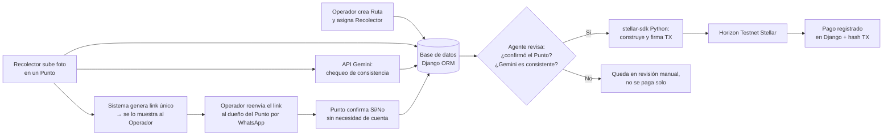

# AgenteKipu

**Stellar Odyssey Perú · Track: AI Agents & Automated Workflows**

Un agente que paga en Stellar testnet **solo cuando un tercero independiente del recolector confirma la entrega** — nunca por el reporte del propio recolector.

Aplicado a la recolección de aceite usado: el fraude ocurre cuando el recolector controla toda la información que le llega al dueño del negocio. El agente no “decide”; aplica dos reglas verificables: confirmación del punto + chequeo de consistencia de una foto.

## El problema

En un negocio real de recolección, un recolector desviaba parte del aceite recogido en su ruta, lo acumulaba en otro lugar y luego se lo vendía a su propio empleador como si fuera un cliente nuevo. Cobró comisión y bono de volumen sobre mercadería que ya pertenecía al negocio. Se descubrió por casualidad.

El sistema debía haber hecho innecesaria esa casualidad: el pago no puede depender de la palabra de quien tiene incentivo de mentir.

## La solución

Hay tres actores. El Operador crea la ruta. El Recolector recorre los puntos y sube una foto. El dueño del local (restaurante, taller, etc.) confirma o niega la entrega **sin crear cuenta**, con un link único.

1. El **Operador** crea una ruta y la asigna a un recolector (asignación directa, no un tablón abierto).
2. El **Recolector** sube, en cada punto, una foto de los baldes recogidos. Esa subida dispara el resto del flujo — no hay GPS.
3. En paralelo:
   - La foto va a la **API de Gemini** con un prompt acotado (por ejemplo: cuántos baldes hay). Es un **chequeo de consistencia de respaldo**, no la prueba principal. Una foto se puede preparar de antemano; no la presentamos como prueba infalible.
   - El sistema genera un link único y se lo muestra **solo al Operador**. El Operador se lo reenvía al dueño del punto por WhatsApp. Si el link se mostrara al recolector, podría confirmarse a sí mismo y el mecanismo colapsaría.
4. El dueño del punto abre el link y responde Sí/No: ¿se recogieron esos baldes en tu local?
5. El **agente** paga la comisión en testnet solo si (a) el punto confirmó “Sí” y (b) el conteo de Gemini está en un rango razonable de lo reportado. Si algo no cuadra, el punto queda **en revisión** y no se paga solo: el Operador decide a mano.
6. El historial guarda la foto, la respuesta de Gemini, la confirmación del punto y el hash de la transacción (o el motivo de no pago).

**Qué sí cubre:** que el recolector desvíe volumen sin que quede registrado en ningún punto real, porque el pago depende de una confirmación que él no controla.

**Qué no promete:** no es una prueba forense. Es una automatización de una decisión que antes dependía enteramente de la palabra del recolector.

## Arquitectura

Detalle en [`docs/architecture.md`](docs/architecture.md).



Toda la lógica de Stellar vive en `core/stellar_agent.py`. La llamada a Gemini vive en `core/gemini_check.py`. Ninguna de las dos va en las vistas. El agente firma con una clave de servidor en `.env`; no usa Freighter.

## Uso de la API de Gemini

Este proyecto usa la **API de Gemini** (Google AI Studio) como **chequeo de consistencia de la foto** del punto de recolección: un conteo acotado que se compara con lo reportado.

Gemini **no** es la señal que dispara el pago y **no** se presenta como detector de fraude. La señal decisiva es la confirmación Sí/No del dueño del punto. Si Gemini falla o el conteo no cuadra, el punto queda en revisión y el pago no sale solo.

## Stack

| Pieza | Elección |
|---|---|
| Backend | Django + SQLite |
| Stellar | `stellar-sdk` (Python), pagos nativos en Horizon Testnet |
| IA | API de Gemini (consistencia de la foto) |
| Frontend | Templates Django + CSS |
| Explorador | [stellar.expert testnet](https://stellar.expert/explorer/testnet) |

Fuera de alcance en esta versión: Celery, contratos Soroban, GPS, marketplace de rutas, Twilio / WhatsApp Business.

## Cómo ejecutarlo

Requisitos: Python 3.12+, una cuenta de [Google AI Studio](https://aistudio.google.com/) si vas a probar Gemini.

```bash
python -m venv .venv
source .venv/bin/activate   # Windows: .venv\Scripts\activate
pip install -r requirements.txt
cp .env.example .env
```

Completa `.env` (nunca subas el archivo real):

```
SECRET_KEY=...
DEBUG=True
STELLAR_SECRET_KEY=           # clave secreta de la cuenta pagadora en testnet
STELLAR_HORIZON_URL=https://horizon-testnet.stellar.org
STELLAR_NETWORK=TESTNET
GEMINI_API_KEY=               # Google AI Studio; solo para el chequeo de consistencia
```

Genera y fondea una wallet de testnet (imprime clave pública y secreta; guarda la secreta en `.env`):

```bash
python scripts/crear_wallet_testnet.py
```

Levanta la app:

```bash
python manage.py migrate
python manage.py runserver
```

Abre [http://127.0.0.1:8000/](http://127.0.0.1:8000/). El admin está en `/admin/`.

Para consultar un hash en Horizon:

```bash
python scripts/verificar_pago.py <tx_hash>
```

## Evidencia en Stellar Testnet

Cuando exista al menos una transacción del flujo (confirmación del punto → pago automático), el hash irá aquí y se podrá ver en el explorador.

- Hash: _pendiente — se publicará en cuanto el flujo de punta a punta envíe la primera TX_
- Explorador: `https://stellar.expert/explorer/testnet/tx/<hash>`

## Qué se construyó durante el evento

- Repositorio, licencia MIT y arquitectura documentada.
- Agente Stellar en Python (`stellar_agent.py`): valida reglas, firma y envía un pago nativo a Horizon Testnet; el hash queda registrado.
- App Django (dashboard, modelos, signals) como base del flujo de verificación y pago.
- Scripts de testnet: crear/fondear wallet con Friendbot y verificar un hash.
- Diseño del flujo AgenteKipu: confirmación de tercero sin login + Gemini como respaldo, no como prueba principal.

En curso hacia el checkpoint del 23 de septiembre: modelos Operador / Recolector / Ruta / Punto / Pago, subida de foto, `gemini_check.py` y la página de confirmación sin cuenta.

## Licencia

[MIT](LICENSE)
