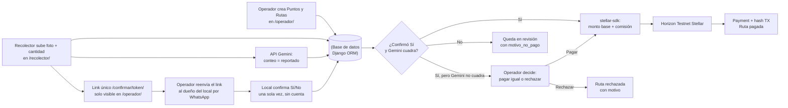

# AgenteKipu

**Stellar Odyssey Perú · Track: AI Agents & Automated Workflows**

Un agente que paga en Stellar testnet **solo cuando un tercero independiente del recolector confirma la entrega** — nunca por el reporte del propio recolector.

## El mecanismo

Tres actores, tres reglas:

- **Operador** carga locales (puntos de recojo) y arma cada visita (ruta): recolector, monto base y fecha.
- **Recolector** reporta la entrega y sube una foto, una sola vez.
- **Dueño del local** (sin cuenta, con un link único) confirma Sí/No — **una sola vez, sin posibilidad de reabrir**.

El pago automático sale solo si el local confirma **Sí** y Gemini cuenta los mismos baldes que el recolector reportó. Gemini es una señal de respaldo probabilística — puede equivocarse — y no decide sola. Si el local dijo Sí y el conteo no cuadra, la ruta queda en revisión: el operador mira la foto y **envía el pago igual** o **lo rechaza con un motivo**. Un pago ya enviado no se revierte.

La comisión por volumen se calcula sobre los baldes reportados de **esa** visita, por encima del promedio del local, y se suma al monto base en el mismo pago. Si la visita no supera el promedio, se paga solo el monto base.

Este mecanismo no depende del material recolectado. Lo que sí está calibrado para el piloto es el chequeo de foto (contar baldes).

## Caso piloto: aceite usado

Luis recolectaba baldes de aceite usado para José, con bono por volumen si entregaba más de 20 juntos. Compraba baldes aparte y los escondía en casa de su suegra; al llegar a 20 se los "vendía" a José como si fuera mercadería nueva, cobrando comisión y bono sobre lo que ya le pertenecía al negocio. Se descubrió por casualidad, cuando un asistente nuevo lo delató.

El sistema debía haber hecho innecesaria esa casualidad: **el pago no puede depender de la palabra de quien tiene el incentivo de mentir.**

## Cómo funciona



1. En `/admin/` se dan de alta el **Operador** (usuario + clave pública Stellar) y el **Recolector** (usuario + clave pública que recibe el pago). El nombre del recolector sale del usuario.
2. El operador entra en `/operador/` y crea **puntos** (nombre, cantidad promedio, comisión por balde extra) y **rutas** (punto, recolector, monto base en XLM, fecha). El admin sigue sirviendo para lo mismo, acotado a las rutas de ese operador.
3. El recolector, en `/recolector/`, sube foto + cantidad **una sola vez**. Eso genera el token (`secrets.token_urlsafe(32)`) y llama a Gemini en el mismo request. Sin GPS: es falsificable desde el navegador y no resuelve el problema real.
4. El link `/confirmar/<token>/` se muestra **solo al operador**. El recolector no lo recibe. El operador lo reenvía por WhatsApp (manual, sin Twilio).
5. El dueño del local responde Sí/No, de una sola vez, aunque Gemini haya fallado o no cuadre. Un segundo POST no pisa la decisión.
6. `signals.py` combina las señales:
   - **Sí + Gemini consistente:** paga solo. El monto es el de la ruta más la comisión: `(baldes reportados − promedio del local) × comisión por balde`, si el excedente es positivo. Esa comisión queda guardada en el `Payment` y no cambia si después se edita el punto.
   - **No**, error de Gemini, o fallo de fondos/Horizon: la ruta queda `en_revision` con `motivo_no_pago`. No hay pago.
   - **Sí + conteo de Gemini distinto:** no paga solo. En el detalle de la ruta el operador puede enviar el pago igual (misma fórmula de comisión, sobre lo reportado) o rechazarla. El rechazo exige un motivo; el recolector lo ve en su ruta. El estado pasa a `rechazado`.

Los paneles de operador, recolector y la página de confirmación consultan un JSON de estado cada 3 segundos. En Pagos se ve el historial, la comisión, el enlace a `stellar.expert` y el saldo XLM (la wallet que paga, derivada de `STELLAR_SECRET_KEY`, o la del recolector).

## Por qué esto no es "otra app de logística"

Confirmación por un tercero no es una idea nueva — es el patrón de cualquier escrow. Lo que no es trivial es a quién convertís en ese tercero. La mayoría de oráculos on-chain asumen una contraparte con wallet o app instalada. El dueño del local en AgenteKipu confirma con un link, sin cuenta, una sola vez.

La irreversibilidad tampoco vale por sí sola — un backend tradicional con buenos controles de acceso logra lo mismo. Vale porque es **verificable por fuera del propio sistema**: cualquiera confirma un pago en `stellar.expert` sin confiar en la palabra del equipo. Un pago enviado no se revierte desde la app.

El agente automático no actúa con una sola señal débil: dispara la ejecución solo cuando coinciden una señal probabilística (Gemini) y una determinística (el sí/no humano, irreversible). Cuando esas dos no coinciden, no inventa un pago: deja la decisión al operador, con la foto a la vista.

## Límites conocidos

- **La comisión es por visita, contra el promedio de ese local.** Repartir volumen desviado en varias visitas chicas, cada una por debajo del promedio, no suma comisión. No hay un umbral acumulado entre rutas.
- **El trust gap se mueve, no desaparece.** El link pasa del sistema al operador, y de ahí al local por WhatsApp. El operador podría reenviarse el link a sí mismo. También puede pagar cuando Gemini no cuadra.
- **Si Gemini falla** (sin API key, timeout, respuesta no parseable), la ruta queda en revisión y el operador no tiene el botón de proceder: ese botón solo aparece cuando Gemini devolvió un conteo distinto al reportado.
- **Alcance:** el aceite usado tiene un fraude real documentado detrás. La misma estructura aplicaría en principio a otras redes de acopio informal, pero no hay evidencia de fraude documentada fuera de este caso.

## Stack

| Pieza | Elección |
|---|---|
| Backend | Django + SQLite |
| Stellar | `stellar-sdk` (Python), pagos nativos en Horizon Testnet |
| IA | API de Gemini (`gemini-3.6-flash`), consistencia de la foto |
| Frontend | Templates Django + CSS; paneles con sondeo cada 3 s |
| Explorador | [stellar.expert testnet](https://stellar.expert/explorer/testnet) |

Fuera de alcance: Celery, contratos Soroban, GPS, marketplace de rutas, Twilio / WhatsApp Business.

| Pieza | Archivo |
|---|---|
| Reglas de pago | `core/signals.py` |
| Firma y envío Stellar | `core/stellar_agent.py` |
| Chequeo de foto | `core/gemini_check.py` |
| Paneles, alta de puntos/rutas, confirmación | `core/views.py` |
| Modelos | `core/models.py` |

## Cómo ejecutarlo

Requisitos: Python 3.12+, una cuenta de [Google AI Studio](https://aistudio.google.com/) si vas a probar Gemini.

```bash
python -m venv .venv
source .venv/bin/activate   # Windows: .venv\Scripts\activate
pip install -r requirements.txt
cp .env.example .env
```

Completa `.env` (nunca subas el archivo real):

```
SECRET_KEY=...
DEBUG=True
STELLAR_SECRET_KEY=           # clave secreta de la cuenta que paga, en testnet
STELLAR_HORIZON_URL=https://horizon-testnet.stellar.org
GEMINI_API_KEY=               # Google AI Studio; solo para el chequeo de consistencia
```

El agente siempre firma para testnet (`Network.TESTNET_NETWORK_PASSPHRASE`). Lee `STELLAR_HORIZON_URL`. El destino de cada pago es la clave pública del recolector. La clave pública del operador (empieza con `G`) se carga en el admin y es la que el panel enlaza en stellar.expert; tiene que ser la pareja de `STELLAR_SECRET_KEY`.

Genera y fondea una wallet de testnet (imprime clave pública y secreta; guarda la secreta en `.env`):

```bash
python scripts/crear_wallet_testnet.py
```

Levanta la app:

```bash
python manage.py migrate
python manage.py createsuperuser
python manage.py runserver
```

Abre [http://127.0.0.1:8000/](http://127.0.0.1:8000/). El admin está en `/admin/`: ahí se crean el operador y el recolector (cada uno atado a un usuario). Después cada uno entra por `/cuentas/entrar/` y cae en su panel.

Para consultar un hash en Horizon:

```bash
python scripts/verificar_pago.py <tx_hash>
```

## Evidencia en Stellar Testnet

Últimas transferencias enviadas, de la más reciente a la más antigua. El total incluye la comisión. **Automático** sale cuando el local confirma Sí y Gemini cuenta los mismos baldes. **Operador** es un pago enviado a mano porque el conteo no cuadró. Cada hash abre la transferencia en el explorador:

| Fecha (UTC) | Punto | Total | Comisión | Pago | Transferencia |
|---|---|---|---|---|---|
| 2026-09-25 01:09 | Restaurante 001 | 1.3 XLM | 0.3 XLM | Automático | [`9ea8404af7f07a4b3514bd60c5d49b894ca240e278217de13267f21828d9be51`](https://stellar.expert/explorer/testnet/tx/9ea8404af7f07a4b3514bd60c5d49b894ca240e278217de13267f21828d9be51) |
| 2026-09-24 23:49 | Restaurante 002 | 1 XLM | 0 XLM | Operador | [`7443bc4d06dd407db86ffe494031614a1d30d2766f08fe18890cb6b3375a4320`](https://stellar.expert/explorer/testnet/tx/7443bc4d06dd407db86ffe494031614a1d30d2766f08fe18890cb6b3375a4320) |
| 2026-09-24 23:41 | Restaurante 002 | 4 XLM | 3 XLM | Automático | [`de712cee1c13f8d89b1f3ae106935ce4dd2101d1a6b55a71a368a7b5c21ed9a1`](https://stellar.expert/explorer/testnet/tx/de712cee1c13f8d89b1f3ae106935ce4dd2101d1a6b55a71a368a7b5c21ed9a1) |
| 2026-09-24 03:26 | Restaurante 001 | 1 XLM | 0 XLM | Automático | [`3d513415e6b86f07269282622bb37bf2e427ae3c6fd6ff31bb158887a2829956`](https://stellar.expert/explorer/testnet/tx/3d513415e6b86f07269282622bb37bf2e427ae3c6fd6ff31bb158887a2829956) |
| 2026-09-24 03:16 | Restaurante 001 | 2.1 XLM | 1.1 XLM | Automático | [`b8efb027d46438c5e7a20494f14a60e3ad222cc0af926dfd6bdc3323b7e52b99`](https://stellar.expert/explorer/testnet/tx/b8efb027d46438c5e7a20494f14a60e3ad222cc0af926dfd6bdc3323b7e52b99) |
| 2026-09-24 03:11 | Restaurante 001 | 1.3 XLM | 0.3 XLM | Operador | [`f5a9077039bdff7f9528b99265502158943b268ddfd7b20c38d24122894b76ec`](https://stellar.expert/explorer/testnet/tx/f5a9077039bdff7f9528b99265502158943b268ddfd7b20c38d24122894b76ec) |

## Código de terceros

El proyecto no parte de un fork ni de un starter kit. El código de la app es propio. Las únicas dependencias de terceros son las de `requirements.txt`; no se copia código de ellas, se instalan como librerías.

| Paquete | Versión | Licencia | Uso |
|---|---|---|---|
| [Django](https://www.djangoproject.com/) | 6.1.1 | BSD-3-Clause | Backend, ORM, admin, templates |
| [stellar-sdk](https://github.com/StellarCN/py-stellar-base) | 16.1.0 | Apache-2.0 | Firma y envío de pagos nativos a Horizon |
| [python-dotenv](https://github.com/theskumar/python-dotenv) | 1.2.3 | BSD-3-Clause | Carga de `.env` |
| [Pillow](https://python-pillow.github.io/) | 11.3.0 | HPND | Subida y manejo de fotos (`ImageField`) |
| [google-genai](https://github.com/googleapis/python-genai) | 2.24.0 | Apache-2.0 | Chequeo de consistencia de la foto (Gemini) |

Sus licencias permiten el uso y la redistribución bajo la MIT de este repositorio. Las dependencias transitivas viajan con cada paquete al instalar.

## Licencia

[MIT](LICENSE)
