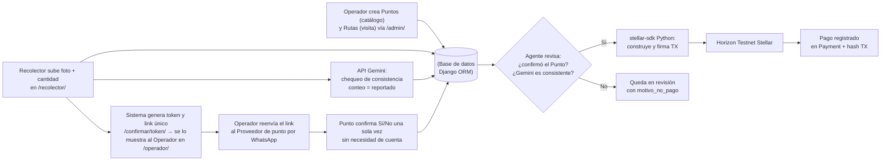

# AgenteKipu

**Stellar Odyssey Perú · Track: AI Agents & Automated Workflows**

Un agente que paga en Stellar testnet **solo cuando un tercero independiente del recolector confirma la entrega** — nunca por el reporte del propio recolector.

## El mecanismo

Tres actores, tres reglas:

- **Operador** crea la ruta (local, recolector, monto, fecha).
- **Recolector** reporta la entrega y sube una foto.
- **Tercero** (el punto de origen, sin cuenta, con un link único) confirma Sí/No — **una sola vez, sin posibilidad de reabrir**.

El pago sale automáticamente solo si el tercero confirma **y** una foto pasa un chequeo de consistencia por IA (Gemini). Gemini es una señal de respaldo probabilística — puede equivocarse — nunca la que decide sola. La señal decisiva es siempre el sí/no humano del tercero.

Este mecanismo no depende del material recolectado. Lo que sí está calibrado para el piloto es el chequeo de foto (contar baldes).

## Caso piloto: aceite usado

Luis recolectaba baldes de aceite usado para José, con bono por volumen si entregaba más de 20 juntos. Compraba baldes aparte y los escondía en casa de su suegra; al llegar a 20 se los "vendía" a José como si fuera mercadería nueva, cobrando comisión y bono sobre lo que ya le pertenecía al negocio. Se descubrió por casualidad, cuando un asistente nuevo lo delató.

El sistema debía haber hecho innecesaria esa casualidad: **el pago no puede depender de la palabra de quien tiene el incentivo de mentir.**

## Cómo funciona



1. El Operador carga el local y crea la ruta desde `/admin/` (scope: construir una UI propia no suma al mecanismo anti-fraude).
2. El Recolector sube foto + cantidad reportada en `/recolector/`. Sin GPS: es falsificable desde el navegador y no resuelve el problema real.
3. La foto dispara dos cosas en paralelo: el chequeo de Gemini, y la generación de un link secreto de confirmación que se le muestra **solo al Operador** (nunca al Recolector — si pudiera verlo, se confirmaría a sí mismo).
4. El Operador reenvía el link al Proveedor de punto por WhatsApp (manual, sin Twilio).
5. El Proveedor confirma Sí/No, de una sola vez. `signals.py` combina ambas señales: si el punto dijo Sí y Gemini cuadra, `stellar_agent.py` firma y envía el pago. Si no, la ruta queda en revisión con `motivo_no_pago` — nadie, ni el equipo, puede pagar manualmente ni revertir un pago ya enviado.

**Qué no cubre todavía:** el bono por volumen acumulado, que fue el mecanismo real del fraude de Luis. Hoy cada ruta paga un monto fijo; un recolector que reparte volumen desviado entre varias rutas pequeñas no dispara alerta. El diseño de esta regla (umbral sobre volumen *confirmado*, no reportado) está pensado pero no implementado — ver [`docs/architecture.md`](docs/architecture.md).

## Por qué esto no es "otra app de logística"

Confirmación por un tercero no es una idea nueva — es el patrón de cualquier escrow. Lo que no es trivial es a quién convertís en ese tercero. La mayoría de oráculos on-chain asumen una contraparte con wallet o app instalada. El Proveedor de punto de AgenteKipu es el dueño de un restaurante informal que nunca usó cripto: confirma con un link, sin cuenta, una sola vez. Diseñar el oráculo para gente sin infraestructura digital previa es el problema real.

La irreversibilidad tampoco vale por sí sola — un backend tradicional con buenos controles de acceso logra lo mismo. Vale porque es **verificable por fuera del propio sistema**: cualquiera confirma un pago en `stellar.expert` sin confiar en la palabra del equipo. AgenteKipu no solo le quita la palabra al recolector — se la quita también al operador y al propio equipo, una vez que el pago sale.

Y el agente nunca actúa con una sola señal débil: dispara la ejecución solo cuando coinciden una señal probabilística (Gemini) y una determinística (el sí/no humano, irreversible). Esa combinación es la decisión de diseño de agente que importa acá.

## Límites conocidos

- **Bono por volumen** (el fraude original): no implementado — ver arriba y `docs/architecture.md`.
- **El trust gap se mueve, no desaparece:** el link pasa del sistema al Operador, y de ahí al Proveedor por WhatsApp manual. AgenteKipu cierra el problema de confianza en el Recolector — no cierra por completo el del Operador, que podría reenviarse el link a sí mismo haciéndose pasar por el punto.
- **Alcance:** el aceite usado tiene un fraude real documentado detrás. La misma estructura aplicaría en principio a otras redes de acopio informal, pero no hay evidencia de fraude documentada fuera de este caso — no se presenta como solución genérica de logística.

## Arquitectura

Detalle técnico completo (modelos Punto/Ruta/Payment, dónde vive cada regla) en [`docs/architecture.md`](docs/architecture.md).

## Stack

| Pieza | Elección |
|---|---|
| Backend | Django + SQLite |
| Stellar | `stellar-sdk` (Python), pagos nativos en Horizon Testnet |
| IA | API de Gemini (consistencia de la foto) |
| Frontend | Templates Django + CSS |
| Explorador | [stellar.expert testnet](https://stellar.expert/explorer/testnet) |

Fuera de alcance en esta versión: Celery, contratos Soroban, GPS, marketplace de rutas, Twilio / WhatsApp Business.

## Cómo ejecutarlo

Requisitos: Python 3.12+, una cuenta de [Google AI Studio](https://aistudio.google.com/) si vas a probar Gemini.

```bash
python -m venv .venv
source .venv/bin/activate   # Windows: .venv\Scripts\activate
pip install -r requirements.txt
cp .env.example .env
```

Completa `.env` (nunca subas el archivo real):

```
SECRET_KEY=...
DEBUG=True
STELLAR_SECRET_KEY=           # clave secreta de la cuenta pagadora en testnet
STELLAR_HORIZON_URL=https://horizon-testnet.stellar.org
GEMINI_API_KEY=               # Google AI Studio; solo para el chequeo de consistencia
```

El agente siempre firma para testnet (`Network.TESTNET_NETWORK_PASSPHRASE`). Lee `STELLAR_HORIZON_URL`.

Genera y fondea una wallet de testnet (imprime clave pública y secreta; guarda la secreta en `.env`):

```bash
python scripts/crear_wallet_testnet.py
```

Levanta la app:

```bash
python manage.py migrate
python manage.py runserver
```

Abre [http://127.0.0.1:8000/](http://127.0.0.1:8000/). El admin está en `/admin/`.

Para consultar un hash en Horizon:

```bash
python scripts/verificar_pago.py <tx_hash>
```

## Evidencia en Stellar Testnet

Tres pagos completados de punta a punta (foto → Gemini → confirmación del punto → pago automático), verificables en el explorador:

| Punto | Ruta | Monto | Estado | Tx hash |
|---|---|---|---|---|
| Restaurante Entrepierna | ruta_alberto_003 | 1 XLM | Completado | `db4368b57800f2d971194cbdc5e31efc375bfc8aedba904a9917bf729b080f7a` |
| Restaurante Alita | ruta_alberto_002 | 1 XLM | Completado | `607714788c08de87a1bdfc31296b40a415510212191b6802a0cd545c35b47adf` |
| Restaurante Pierna | ruta_alberto_001 | 1 XLM | Completado | `a4826588dc4a4f4e70f67fc16ddb93d7bd3bc3ff3abf92702eee7d7c4dff870c` |

- Explorador: `https://stellar.expert/explorer/testnet/tx/<hash>`

## Qué se construyó durante el evento

- Repositorio, licencia MIT y arquitectura documentada.
- Agente Stellar en Python (`stellar_agent.py`): firma y envía un pago nativo a Horizon Testnet; el hash queda registrado. Las reglas (Sí + Gemini consistente) viven en `signals.py`.
- App Django (dashboard, modelos, signals) que soporta el flujo completo de verificación y pago.
- Scripts de testnet: crear/fondear wallet con Friendbot y verificar un hash.
- Flujo de punta a punta funcionando: foto → Gemini → link de confirmación → confirmación del punto → pago automático — con tres transacciones completadas en Horizon Testnet (ver Evidencia arriba).

## Licencia

[MIT](LICENSE)