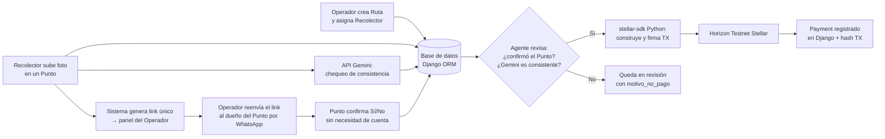

# Arquitectura — AgenteKipu

Agente que paga en Stellar testnet solo cuando un tercero independiente del recolector confirma la entrega. Caso: recolección de aceite usado. El trigger no es el reporte del recolector ni una IA "decidiendo"; son dos reglas verificables: confirmación del punto + chequeo de consistencia de Gemini.

## Actores

| Actor | Rol | Cuenta en el sistema |
|---|---|---|
| Operador | Crea rutas (hoy en `/admin/`), reenvía el link de confirmación, ve `motivo_no_pago` en el panel (solo lectura: no paga ni desbloquea a mano) | Sí — panel `/operador/` |
| Recolector | Recorre la ruta y sube una foto por punto | Sí — panel `/recolector/` |
| Proveedor de punto | Dueño del local. Confirma Sí/No | No — `/confirmar/<token>/` sin login |

El link de confirmación se muestra **solo al Operador** (`url_confirmacion` en detalle de ruta/punto). El Recolector no lo recibe en el contexto ni en el template. Si lo viera, podría confirmarse a sí mismo.

## Flujo construido

1. El Operador tiene una `Ruta` asignada a un `Recolector` (asignación directa).
2. El Recolector, en cada `Punto`, sube foto + cantidad **una sola vez**. Eso genera `token_confirmacion` (`secrets.token_urlsafe(32)`) y llama a Gemini en el mismo request. Reemplazar la foto reintentaría el chequeo de consistencia; la vista no lo permite.
3. Gemini (`gemini_check.py`, `gemini-3.6-flash`) cuenta baldes; consistente si el conteo es **igual** a lo reportado. Si falla, la foto queda y se guarda `gemini_error`. **Eso no cambia el estado ni cierra `/confirmar/`** — Gemini no tiene veto sobre la señal del tercero.
4. El Operador copia `/confirmar/<token>/` y lo reenvía por WhatsApp. El Recolector no ve ese URL.
5. El dueño del local responde Sí/No **aunque Gemini haya fallado o no cuadre**. Un segundo POST no pisa la decisión (`update()` acotado a `confirmacion is None` y no `pagado`; 0 filas → relectura).
6. Recién entonces el agente combina ambas señales y paga solo si confirmó Sí **y** Gemini es consistente:
   - `Payment` se crea `pendiente` **antes** de Horizon (unique de `punto` como exclusión).
   - Éxito: `tx_hash` + `completado`; Punto a `pagado` con `.update()`.
   - Cualquier excepción: `payment.delete()`; el motivo queda en `Punto.motivo_no_pago`.
7. Si No, o Sí + Gemini inconsistente/error, o fallo de fondos/Horizon: `en_revision` y no se paga solo. El panel del Operador muestra `motivo_no_pago`; no hay botón para pagar a mano.

## Modelo de datos (flujo activo)

| Modelo | Qué guarda |
|---|---|
| **Operador** | `user` (OneToOne), `nombre` |
| **Recolector** | `user` (OneToOne), `nombre`, `direccion_stellar` |
| **Ruta** | `operador`, `recolector`, `nombre`, `fecha` |
| **Punto** | `ruta`, `nombre_local`, `monto`, foto, cantidad, Gemini (`gemini_cantidad`, `gemini_consistente`, `gemini_respuesta`, `gemini_error`), `token_confirmacion`, `confirmacion` Sí/No, estado (`pendiente` / `confirmado` / `en_revision` / `pagado`), `motivo_no_pago` |
| **Payment** | OneToOne a **Punto**, `tx_hash`, `monto`, `fecha`, estado. No guarda foto, Gemini ni confirmación. |

## Dónde vive cada pieza

| Pieza | Archivo |
|---|---|
| Firma y envío Stellar | `core/stellar_agent.py` (duck-type `pk`, `monto`, `direccion_stellar`; no lee confirmación ni Gemini) |
| Reglas de pago (Sí + consistente) | `core/signals.py` → `intentar_pago_si_corresponde`; sin confirmación del local, Gemini no cambia el estado. La vista pública lo llama a mano porque `update()` no dispara `post_save` |
| Gemini | `core/gemini_check.py` (`gemini-3.6-flash`); lo invoca `views.subir_foto` en el request de la foto |
| Paneles y confirmación | `core/views.py` |
| Scripts testnet | `scripts/crear_wallet_testnet.py`, `scripts/verificar_pago.py` |

## Permisos

- Recolector: queryset `ruta__recolector=…`. 404 si el punto no es suyo. Sin token en el template.
- Operador: queryset `ruta__operador__user=request.user` (o equivalente). 404 si la ruta/punto es de otro.
- Confirmación pública: autorización = token; POST solo si `confirmacion is None` y el punto no está `pagado`. Gemini no cierra el endpoint.
- Los paneles `/operador/` y `/recolector/` (y `/confirmar/` mientras el formulario está abierto) consultan un JSON de estado cada 3 s. Sin Channels ni WebSockets. El JSON del recolector no incluye el token.
- Admin `Punto` y `Payment`: no superuser → mismo recorte por operador. Superuser ve todo.

## Stack (como está)

| Decisión | Por qué |
|---|---|
| Django + SQLite | Sin Postgres. `select_for_update` no bloquea filas aquí; la exclusión de pago es el unique de `Payment.punto`. |
| `stellar-sdk` Python | Pagos nativos a Horizon Testnet. |
| API de Gemini (`google-genai`) | Consistencia de la foto; modelo `gemini-3.6-flash`; timeout 15 s; no dispara el pago ni cierra la confirmación. |
| Templates Django + CSS | Sin React. |
| Red Stellar | El agente siempre firma con `Network.TESTNET_NETWORK_PASSPHRASE`. Lee `STELLAR_HORIZON_URL`. |
| Sin GPS, marketplace, Celery, Twilio | El Operador reenvía el link por WhatsApp personal. |

## Checklist de lo construido

- [x] Modelos Operador, Recolector, Ruta, Punto, Payment (FK a Punto)
- [x] Migraciones `0003` / `0004` / `0005` (sin Worker/Task)
- [x] Signal de pago: combina Sí + Gemini consistente **después** de la confirmación; INSERT `pendiente` antes de Horizon; `delete` si falla
- [x] Sin botón manual de verificar (el panel del Operador es lectura + copia del link)
- [x] Subida de foto del Recolector (una sola vez por punto); `views.subir_foto` llama a `gemini_check.py`
- [x] Token `secrets.token_urlsafe(32)` y página `/confirmar/<token>/` abierta aunque Gemini falle
- [x] Panel Operador con URL lista para copiar; Recolector sin el link
- [x] Admin de Punto/Payment acotado al operador (salvo superuser)
- [x] `motivo_no_pago` distingue No / Gemini / fondos u Horizon
- [x] `stellar_agent.py` paga a `direccion_stellar` del recolector

## Fuera de alcance (v1)

- Sin Celery — Gemini y el pago son síncronos
- Sin contrato Soroban
- Sin GPS ni marketplace de rutas
- Sin Twilio / WhatsApp Business
- Alta de rutas/puntos: `/admin/` (el panel del Operador es lectura + copia del link)
