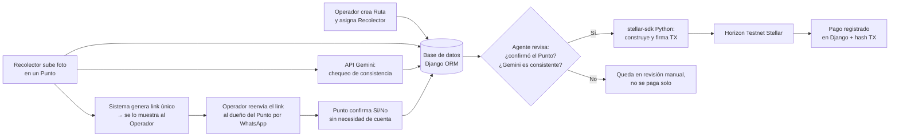

# Arquitectura — AgenteKipu

Agente que paga en Stellar testnet solo cuando un tercero independiente del recolector confirma la entrega. Caso: recolección de aceite usado. El trigger no es el reporte del recolector ni una IA "decidiendo"; son dos reglas verificables: confirmación del punto + chequeo de consistencia de Gemini.

## Actores

| Actor | Rol | Cuenta en el sistema |
|---|---|---|
| Operador | Crea rutas, asigna recolectores, reenvía el link de confirmación, decide a mano si un punto queda en revisión | Sí |
| Recolector | Recorre la ruta y sube una foto por punto | Sí |
| Proveedor de punto | Dueño del local (ej. restaurante). Confirma Sí/No por un link único | No — sin login |

El link de confirmación se muestra **solo al Operador**, nunca al Recolector. Si el recolector lo viera, podría confirmarse a sí mismo y el mecanismo anti-fraude colapsa.

## Flujo

1. El Operador crea una `Ruta` y asigna un Recolector (asignación directa, no marketplace).
2. El Recolector, en cada `Punto`, sube una foto de los baldes recogidos. Subir la foto dispara el resto del flujo (no hay GPS).
3. En paralelo:
   - Se envía la foto a la API de Gemini con un prompt acotado (chequeo de consistencia de respaldo, no prueba principal).
   - El sistema genera un link único de confirmación y se lo muestra al Operador, quien lo reenvía por WhatsApp al dueño del punto.
4. El dueño del punto abre el link (sin cuenta) y responde Sí/No a la cantidad reportada.
5. El agente revisa: (a) el punto confirmó "Sí", y (b) el conteo de Gemini está en un rango razonable de lo reportado.
   - Si ambas se cumplen: construye y firma la TX con `stellar-sdk` y la envía a Horizon Testnet. El hash queda en `Pago`.
   - Si algo no cuadra: el punto queda "en revisión" y no se paga solo. El Operador decide a mano.
6. El historial guarda foto, respuesta de Gemini, confirmación del punto, y el hash (o el motivo de no pago).

## Modelo de datos

- **Operador:** dueño del negocio; crea rutas y autoriza el reenvío del link.
- **Recolector:** nombre, `direccion_stellar`; asignado a una o más rutas.
- **Ruta:** puntos de recolección asignados a un recolector específico.
- **Punto:** local de la ruta; foto subida, resultado de Gemini, token/link de confirmación, respuesta Sí/No del proveedor, estado (pendiente / confirmado / en revisión / pagado).
- **Pago:** relación con el punto (o la comisión de esa entrega), `tx_hash`, monto, fecha, estado.

La lógica de Stellar vive en `stellar_agent.py`. La llamada a Gemini vive en `gemini_check.py`. Ninguna de las dos va en `views.py`.

## Decisión de stack

| Decisión | Por qué |
|---|---|
| Backend: Django + SQLite | Modelo de datos real (Operador, Recolector, Ruta, Punto, Pago) sin levantar Postgres. |
| Stellar: `stellar-sdk` para Python | Misma runtime que Django; `pip install stellar-sdk`. |
| IA: API de Gemini | Chequeo de consistencia de la foto; no se presenta como prueba de fraude. |
| Frontend: templates Django + CSS | Server-rendered, sin framework JS. |
| Sin GPS/geolocalización | Falsificable desde el navegador; no resuelve el problema. La confirmación de un tercero sí. |
| Sin marketplace/tablón de rutas | Asignación directa Operador→Recolector; el tablón no suma al track. |
| Sin Celery ni cola de tareas | El pago se ejecuta de forma síncrona al confirmarse la entrega. |
| Sin API de mensajería | El Operador reenvía el link por WhatsApp personal. |

## Fuera de alcance (v1)

- Sin Celery/cola de tareas — ejecución síncrona
- Sin contrato Soroban — pagos nativos vía SDK
- Sin GPS
- Sin marketplace de rutas
- Sin Twilio / WhatsApp Business
- Gemini no es la señal que dispara el pago; si la API falla, el punto no se paga solo
